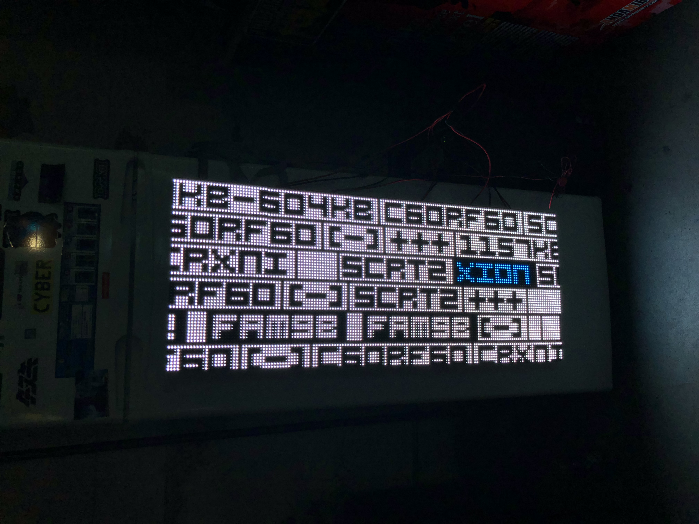

# Fridge Visuals
This is a collection of visualizations for the ten LED panels attached to the refrigerator at XION arcade.

## Visuals
### [Cosmopolitan](cosmopolitan/)
Inspired by some of the LED displays at The Cosmopolitan casino in Las Vegas. Sparkles and shards float up toward the top, bright flashes occasionally. Procedurally generated and random, guaranteed to be unique every time!

### [Codeblocks](codeblocks/)
This was inspired by an art installation somewhere in Sydney, Australia. Random(?) blocks of what appears to be code floats by with an occasional flash of the rainbow. 

