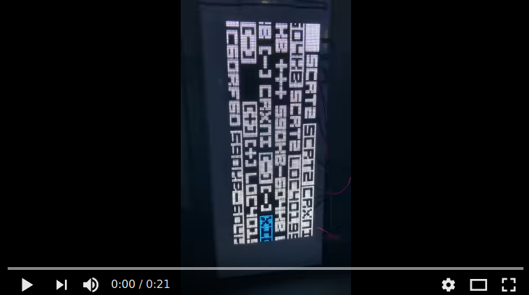

# Codeblocks FridgeVisual
This was inspired by an art installation somewhere in Sydney, Australia. Random(?) blocks of what appears to be code floats by with an occasional flash of the rainbow. 

## Details
This is my first time using [Processing](https://processing.org/). Quite fun, but I'm only just scratching the potential of it here.

### Building
You can build this with the horrible Processing GUI if you want. But the better way in my opinion is from the command line via `processing-java`:

    processing-java --force --sketch=../codeblocks --output=out --run

and if you want to build a "portable" executable:

    processing-java --sketch=../codeblocks --export

