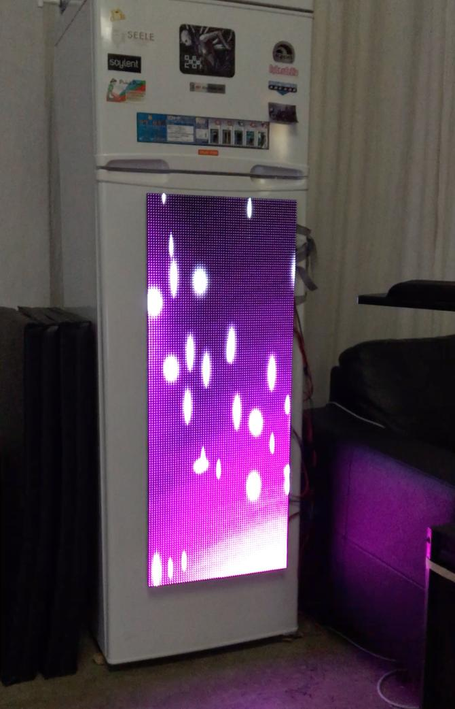

# Cosmopolitan FridgeVisual 

Inspired by some of the LED displays at The Cosmopolitan casino in Las Vegas. Sparkles and shards float up toward the top, bright flashes occasionally. Procedurally generated and random, guaranteed to be unique every time!

## Details
### Building
Requires SDL2 and GraphicsMagick++. Simply run `make` to build.

### Running
Each individual visualization will be built in `bin`. To run it, specify a canvas width and height, optionally pass `-w` to run in windowed mode.

	usage: [visualization] width height [-w]
	    -w : windowed mode

### Development
Currently this project includes a really basic 2D graphics engine. There are scenes, scene nodes, and scene objects (actors). Read more about this paradigm [here](https://cs.senecac.on.ca/~gam531/?q=node/31). 
